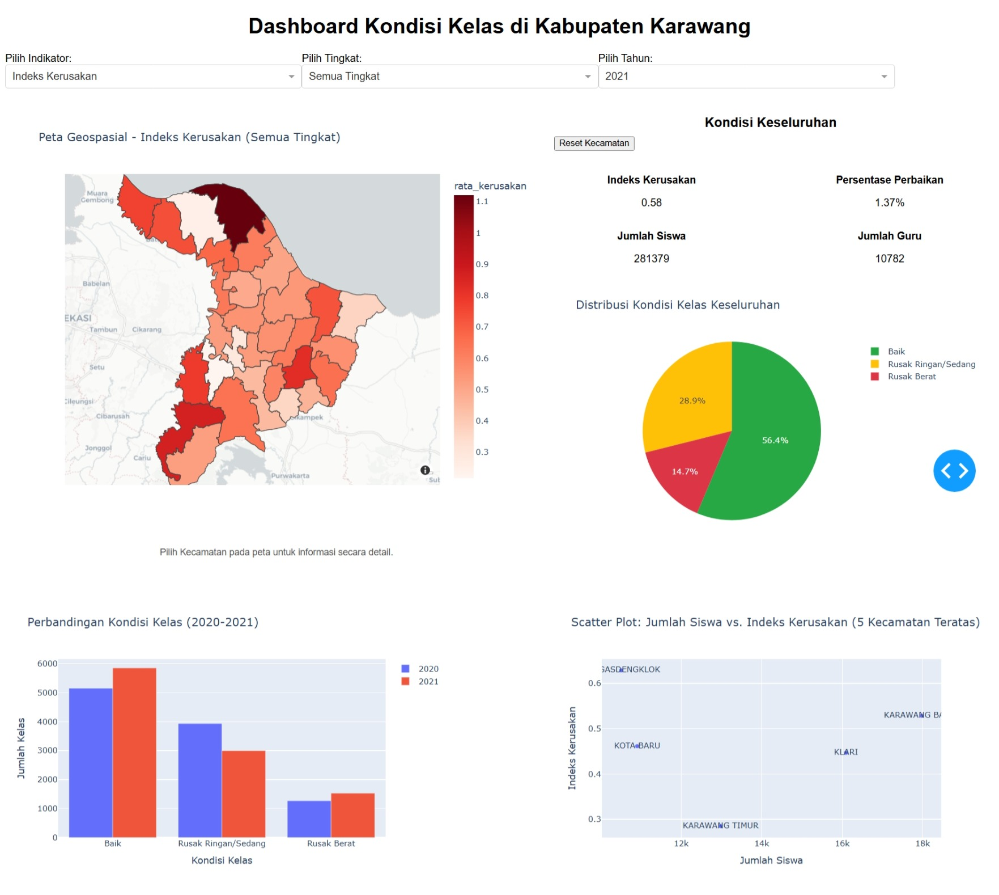
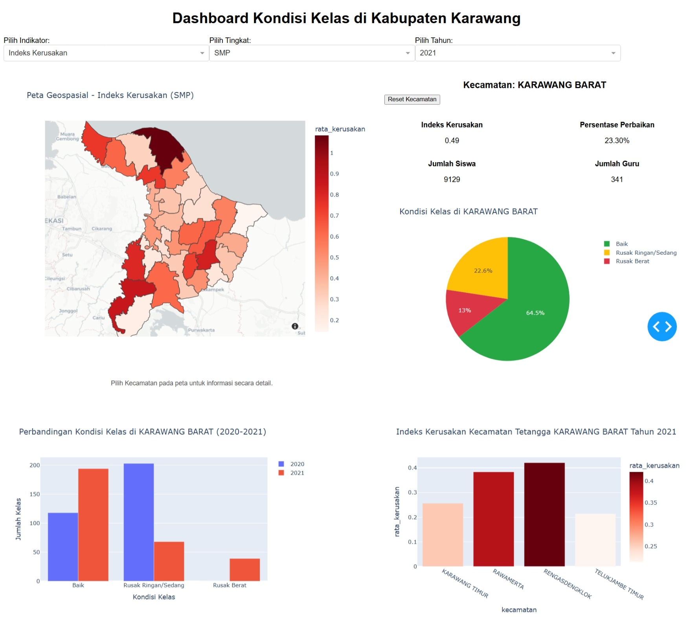
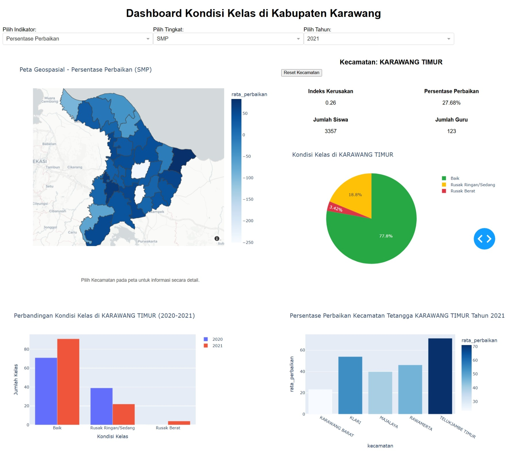

# 🏫 Karawang School Infrastructure Analysis (2020-2021)
**Status: Portfolio in Progress**

An interactive geospatial dashboard built with **Python Dash** to analyze and map classroom conditions for Elementary (SD) and Junior High Schools (SMP) in Karawang Regency, focusing on the **2020-2021 period**.

---

## 🚀 Project Overview
This project visualizes school infrastructure damage levels to help identify priority areas for renovations. It transforms raw educational data from **2020 and 2021** into an interactive map and analytical charts.

## 📊 Dashboard Preview

### 1. Overall Dashboard
Main interface displaying the spatial distribution of classroom damage across Karawang Regency.

### 2. District Detail & Comparison
Interactive feature triggered when a user selects a specific district (kecamatan) on the map to see detailed metrics.

### 3. Renovation Rate
Visualization comparing classroom conditions and renovation progress between 2020 and 2021.

### 📍 Roadmap & Progress
- [x] **Interactive Dashboard:** Core visualization and filtering system for 2020-2021 data.
- [ ] **Data Preprocessing Documentation:** Consolidating raw data cleaning (2020-2021 datasets), feature engineering, and geospatial integration into a single Jupyter Notebook.

## 📊 Features
* **Geospatial Mapping:** Interactive choropleth map of Karawang Regency.
* **Time-Period Selection:** Compare school conditions between **2020 and 2021**.
* **Dynamic Indicators:** Toggle between Damage Index, Repair Percentage, and Student/Teacher counts.
* **Comparative Analysis:** View classroom conditions (Good, Slightly Damaged, Heavily Damaged).

## 🛠️ Tech Stack
* **Language:** Python
* **Framework:** Dash
* **Visualization:** Plotly, Plotly Express
* **Geospatial:** GeoPandas, Shapely
* **Data Handling:** Pandas

## ⚙️ How to Run
1. **Clone the repository**
2. **Install dependencies:** `pip install -r requirements.txt`
3. **Run the application:** `python app.py`

---
*Created by bay195*
